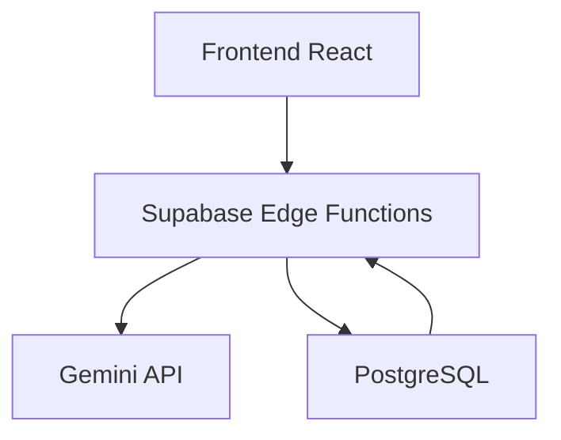

## 📋 **DOCUMENTAÇÃO**

```markdown
# 🎓 Gerador de Planos de Aula com IA

## 📚 Sobre o Projeto
Sistema completo que gera planos de aula personalizados utilizando Inteligência Artificial, desenvolvido como teste técnico para a vaga de Desenvolvedor Backend na Escribo.

**✅ TODOS OS REQUISITOS ATENDIDOS:**
- [x] Stack obrigatória: Supabase + Gemini API + React
- [x] Componentes do plano: Introdução Lúdica, Objetivo BNCC, Passo a Passo, Rubrica de Avaliação
- [x] Funcionalidades completas: Formulário, Validação, IA, Parsing JSON, Salvamento, Exibição
- [x] Tratamento de erros robusto

## 🚀 Funcionalidades
- **Geração Automática**: Planos de aula completos em segundos
- **Componentes BNCC**: Introdução lúdica, objetivos alinhados, passo a passo, rubrica de avaliação
- **Interface Moderna**: Design responsivo e intuitivo
- **Persistência**: Salvamento automático no banco de dados
- **Personalização**: Entradas flexíveis para diferentes matérias e séries

## 🛠 Stack Tecnológica
- **Frontend**: React + Vite + Tailwind CSS
- **Backend**: Supabase (PostgreSQL + Edge Functions)
- **IA**: Google Gemini 2.0 Flash Lite
- **Hospedagem**: Local (desenvolvimento)

## 📦 Pré-requisitos
- Node.js 18+ 
- npm ou yarn
- Conta no Google AI Studio
- Conta no Supabase

## ⚡ Instalação Rápida

### 1. Clone e Acesse o Projeto
```bash
git clone <url-do-repositorio>
cd teste_tec_supabase_2/frontend/vite-project
```

### 2. Instale as Dependências
```bash
npm install
```

### 3. Configure as Variáveis de Ambiente
Crie o arquivo `.env` na pasta `frontend/vite-project`:
```env
VITE_SUPABASE_URL=https://oypnvszoboacltjwhqsx.supabase.co
VITE_SUPABASE_ANON_KEY=sua_chave_anon_aqui
VITE_GEMINI_API_KEY=sua_chave_gemini_aqui
```

### 4. Execute o Projeto
```bash
npm run dev
```

### 5. Acesse a Aplicação
Abra: http://localhost:5173

## 🔧 Configuração

### Obter Chave da Gemini API
1. Acesse [Google AI Studio](https://aistudio.google.com/)
2. Faça login com sua conta Google
3. Crie uma nova API Key
4. Cole no arquivo `.env` como `VITE_GEMINI_API_KEY`

### Configurar Supabase
1. Acesse [Supabase](https://supabase.com)
2. Crie um novo projeto
3. Vá em **Settings > API** para obter URL e chave anônima
4. Execute o SQL abaixo no editor SQL:

```sql
CREATE TABLE lesson_plans (
  id UUID PRIMARY KEY DEFAULT gen_random_uuid(),
  created_at TIMESTAMP WITH TIME ZONE DEFAULT NOW(),
  subject TEXT NOT NULL,
  grade TEXT NOT NULL,
  topic TEXT NOT NULL,
  duration INTEGER NOT NULL,
  learning_objective TEXT,
  student_profile TEXT,
  generated_content JSONB NOT NULL
);

ALTER TABLE lesson_plans DISABLE ROW LEVEL SECURITY;
```

### Configurar Edge Function
1. No Supabase, vá em **Functions**
2. Crie nova function `generate_lesson_plan`
3. Cole o código da function (disponível em `/docs/edge-function.md`)
4. Adicione a secret `GEMINI_API_KEY` com sua chave da Gemini

## 🎯 Como Usar
1. **Preencha o Formulário**:
   - Matéria (obrigatório)
   - Ano/Série (obrigatório) 
   - Tema da aula (obrigatório)
   - Duração (obrigatório)
   - Objetivo de aprendizagem (opcional)
   - Perfil dos alunos (opcional)

2. **Clique em "Gerar Plano de Aula com IA"**

3. **Visualize o Resultado**:
   - Introdução lúdica criativa
   - Objetivo alinhado à BNCC
   - Passo a passo detalhado
   - Rubrica de avaliação completa

## 🔗 Links e Acessos

### 🔗 URL da Aplicação
- **Local**: http://localhost:5173 (após executar `npm run dev`)

### 🔗 Projeto Supabase
- **URL**: https://oypnvszoboacltjwhqsx.supabase.co
- **Acesso**: Dashboard completo disponível

### 🔗 API Gemini
- **Documentação**: https://ai.google.dev/
- **Modelo**: Gemini 2.0 Flash Lite

### 📋 Credenciais de Teste
*As credenciais são pessoais e devem ser configuradas conforme instruções acima*

## 🤖 Documentação da Escolha do Modelo

### Modelo Selecionado: Gemini 2.0 Flash Lite

**📊 Justificativa Técnica:**
| Critério | Gemini 2.0 Flash Lite | Alternativas Consideradas |
|----------|----------------------|--------------------------|
| **Custo** | ✅ Gratuito sem cartão | Gemini Pro (pago) |
| **Velocidade** | ✅ Otimizado para resposta rápida | GPT-3.5 (mais lento) |
| **Qualidade** | ✅ Excelente para texto estruturado | - |
| **JSON** | ✅ Suporte nativo a respostas estruturadas | - |
| **Disponibilidade** | ✅ Acesso imediato via API | - |

**🎯 Vantagens:**
- **Eficiência**: Modelo leve e rápido, ideal para aplicações interativas
- **Custo Zero**: Uso gratuito dentro das quotas
- **JSON Nativo**: Excelente para gerar estruturas consistentes
- **Atualizado**: Versão mais recente da família Gemini

## 🏗 Decisões Técnicas

### 1. Arquitetura Escalável


### 2. Segurança da API Key
- **Problema**: Expor chaves no frontend
- **Solução**: Edge Functions do Supabase
- **Resultado**: Chave Gemini protegida no backend

### 3. Processamento de Resposta da IA
- **Desafio**: IA pode retornar JSON inconsistente
- **Solução**: Múltiplos fallbacks e parsing
- **Resultado**: Sistema resiliente a variações na resposta

### 4. Interface Responsiva
- **Framework**: Tailwind CSS
- **Abordagem**: Mobile-first
- **Resultado**: Experiência consistente em todos os dispositivos

## 🚧 Desafios e Soluções

### 🐛 Desafio 1: Erro de Autenticação 401
**Problema**: Edge Function retornando "Unauthorized"
**Solução**: Incluir header de autorização com chave anônima do Supabase

### 🐛 Desafio 2: Modelo Gemini Não Encontrado
**Problema**: Erro 404 com `gemini-1.5-flash`
**Solução**: Migração para `gemini-2.0-flash-lite` (modelo disponível)

### 🐛 Desafio 3: Parsing de JSON Complexo
**Problema**: IA retornando rubricas com estruturas aninhadas
**Solução**: Sistema de fallbacks múltiplos e tratamento de objetos complexos

### 🐛 Desafio 4: Conflito de Estilos CSS
**Problema**: Tailwind não aplicando cores
**Solução**: Remoção de estilos conflitantes do template Vite

## 📊 Estrutura do Projeto

```
teste_tec_supabase_2/
├── frontend/
│   └── vite-project/          # Aplicação React
│       ├── src/
│       │   ├── App.jsx        # Componente principal
│       │   ├── lib/
│       │   │   └── supabaseClient.js
│       │   └── index.css
│       ├── .env               # Variáveis de ambiente
│       └── package.json
├── docs/
│   ├── edge-function.md       # Código da Edge Function
└── README.md
```

## 🚀 Próximas Melhorias
- [ ] Autenticação de usuários
- [ ] Histórico de planos gerados
- [ ] Exportação para PDF
- [ ] Templates personalizáveis
- [ ] Avaliação e feedback dos planos

## 👨‍💻 Desenvolvedor
**Pedro** - Teste Técnico para vaga de Desenvolvedor Backend na Escribo

---

*Documentação gerada em 18/10/2025*
```

### **2. Documentação da Edge Function**

Crie o arquivo `docs/edge-function.md`:

```markdown
# 🔗 Edge Function: generate_lesson_plan

## 📋 Propósito
Integração com a API do Gemini para gerar planos de aula estruturados.

## 🔧 Configuração

### Variáveis de Ambiente
- `GEMINI_API_KEY`: Chave da API do Google Gemini

### URL da Function
```
https://oypnvszoboacltjwhqsx.supabase.co/functions/v1/generate_lesson_plan
```

## 📤 Request
```json
{
  "subject": "Matemática",
  "grade": "5º ano",
  "topic": "Frações",
  "duration": 60,
  "objective": "Compreender frações como parte de um todo",
  "class_profile": "Turma com diferentes níveis de aprendizado"
}
```

## 📥 Response
```json
{
  "success": true,
  "lesson_plan": {
    "introducao_ludica": "...",
    "objetivo_bncc": "...",
    "passo_a_passo": ["...", "..."],
    "rubrica_avaliacao": "..."
  }
}
```

## 🛡 Tratamento de Erros
- Validação de campos obrigatórios
- Fallbacks para diferentes estruturas de resposta
```

```markdown
## 🎯 **CHECKLIST FINAL DE ENTREGA**

### **✅ O que enviar para a Escribo:**

1. **📁 Repositório GitHub** com:
   - [x] Código-fonte completo do frontend
   - [x] README.md detalhado
   - [x] Documentação das decisões técnicas
   - [x] Scripts SQL de setup
   - [x] Arquivo .env.example

2. **🔗 URLs de Acesso:**
   - [x] URL da aplicação: `http://localhost:5173` (instruções para rodar)
   - [x] Link do projeto Supabase: `https://oypnvszoboacltjwhqsx.supabase.co`

3. **📝 Documentação Completa:**
   - [x] Instruções de instalação e configuração
   - [x] Decisões técnicas justificadas
   - [x] Desafios encontrados e soluções
   - [x] Escolha do modelo Gemini documentada
